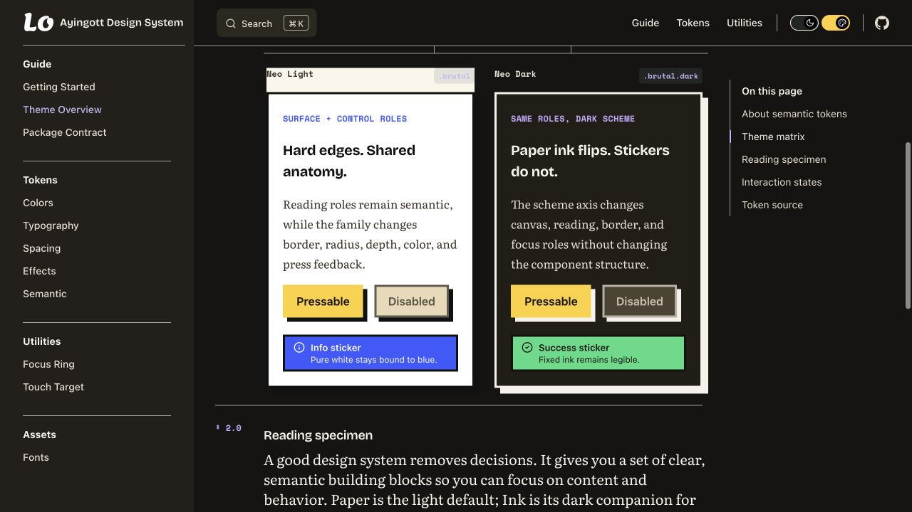
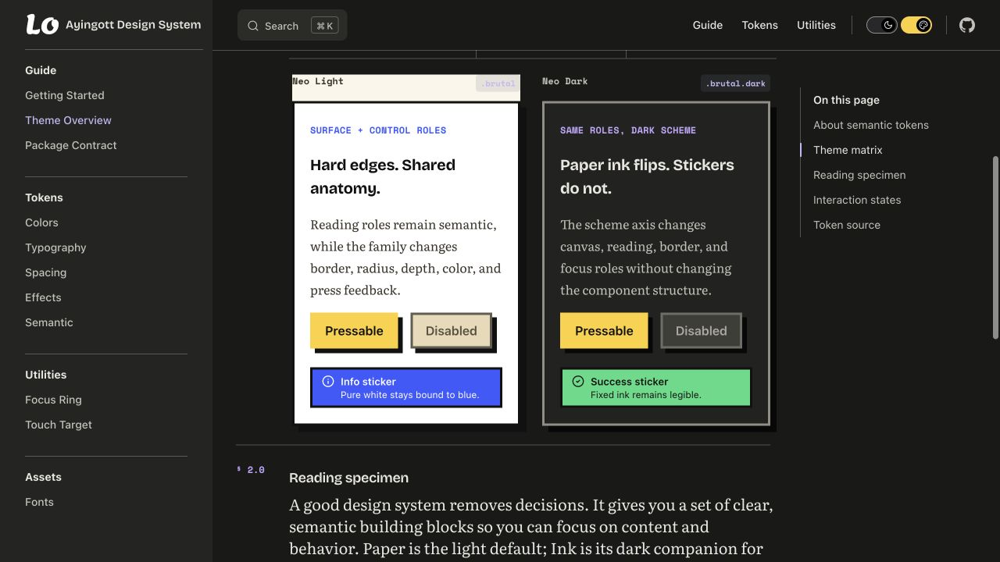
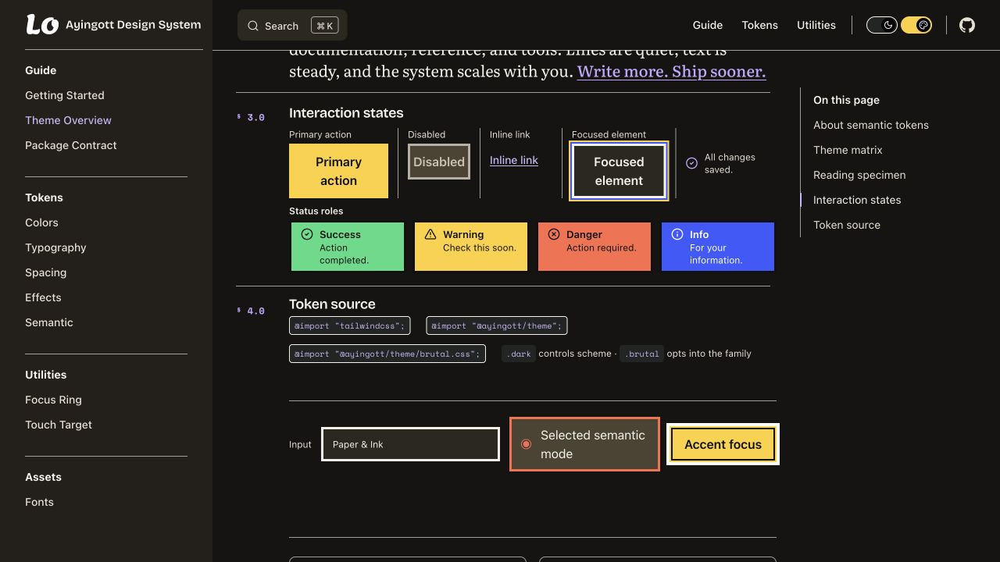
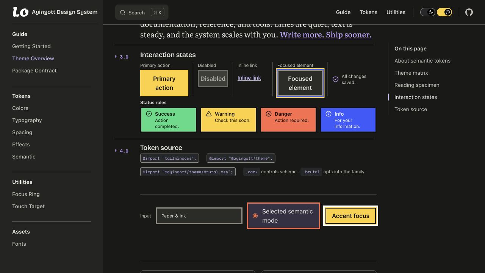
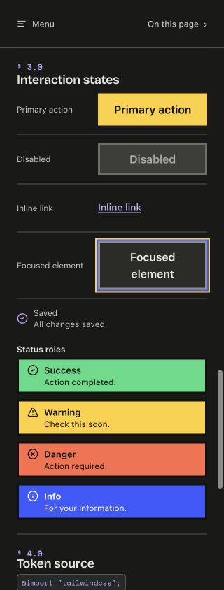

# Neo Dark 配色更新 spec

| 项目 | 内容 |
| --- | --- |
| 状态 | Proposed；配色原型验证完成，供审阅 |
| 日期 | 2026-09-09 |
| 基准 | `3c206755f44dc07475369701f547b23857dffd9c` |
| 影响范围 | `@ayingott/theme/brutal.css` 的暗色语义映射与 Neo 语义投影 |
| 当前执行情况 | 已验证候选覆盖层；未修改包源码或现行契约 |
| 历史关系 | 若采纳，取代原 RFC 中“Neo 投影使用正文 family ink”的约定；原 RFC 保留为历史记录 |

## 1. 推荐方案

Neo Dark 改为低彩度暖炭灰表面、米白正文、中等亮度的普通描边与深色硬投影。选中背景使用深紫色，与弱化表面的暖灰区分。保留六种贴纸色、直角、3px 结构边框和零模糊偏移。

这次验证支持先调整基础表面和结构颜色：候选中没有改变黄、粉、蓝、绿、紫、橙六色，卡片的白色背板感已经消失，禁用状态的轮廓也不再与主操作竞争。选中项恢复了独立的色相。视觉协调性的判断基于本次截图，最终审美取舍由审阅确认。

实现采用现有角色加一个内部投影色。消费者继续使用原有语义变量，无需安装新依赖、修改类名、增加配置或迁移组件结构。

## 2. 暗色色值变更

下表中的 `--surface-canvas` 与 `--text-primary` 继续分别映射到 `--brutal-canvas` 与 `--brutal-ink`。其余未列出的现有语义声明保持原值或原映射。

| 角色 | 当前值 | 建议值 | 用途 |
| --- | --- | --- | --- |
| `--surface-canvas` | `#161412` | `#191918` | 减少整页的褐色倾向 |
| `--surface-panel` | `#211E16` | `#222220` | 面板保持轻微暖意 |
| `--surface-elevated` | `#2C281E` | `#2B2B28` | 卡片、输入框的承载表面 |
| `--surface-subtle` | `#3A3427` | `#343430` | 内嵌区与普通 hover 背景 |
| `--surface-muted` | `#4C4432` | `#3E3E38` | 弱化、禁用表面 |
| `--text-primary` | `#F5F2EA` | `#E8E6DF` | 正文与标题 |
| `--text-secondary` | `#E7DFD2` | `#C3C1B8` | 支持性文字 |
| `--text-muted` | `#CAC1B0` | `#AAA89E` | 标签、辅助信息与占位文字 |
| `--border-subtle` | `rgb(245 242 234 / 0.62)` | `rgb(232 230 223 / 0.28)` | 装饰分隔线与弱轮廓 |
| `--border-default` | `var(--brutal-ink)` | `#908E84` | 普通控件、卡片轮廓 |
| `--border-strong` | `var(--brutal-ink)` | `#D1CEC4` | 需要强调的轮廓 |
| `--accent-soft` | `#4C4432` | `#373044` | 深紫色选中背景 |
| `--shadow-card` | `6px 6px 0 var(--brutal-ink)` | `6px 6px 0 var(--brutal-shadow)` | 控件与卡片的硬投影 |
| `--shadow-panel` | `8px 8px 0 var(--brutal-ink)` | `8px 8px 0 var(--brutal-shadow)` | 面板硬投影 |

新增的 `--brutal-shadow` 是契约管理的内部 palette 值，和其他 `--brutal-*` 一样，不是消费者直接使用的公共 API：

| 模式 | `--brutal-shadow` |
| --- | --- |
| `.brutal` | `#111111` |
| `.brutal.dark` | `#080808` |

深色投影比旧的白色投影弱，这是有意的取舍。控件的识别依靠有足够对比度的轮廓与内容，投影负责表达偏移深度。不要继续压低 `--border-default` 来补偿投影；当前值在最亮的弱化表面上保留了 3.27:1 的余量。

## 3. 映射规则

### 3.1 文字、轮廓、投影分别决定颜色

`--brutal-ink` 继续服务于正文。普通与强调边框在暗色下分别使用上表的字面值。`--shadow-card`、`--shadow-panel` 和 `pressable` 的深度颜色统一使用 `--brutal-shadow`。

Neo Light 的边框仍为 `var(--brutal-ink)`。新的投影映射在 Neo Light 中仍解析成 `#111111`，保持现有效果。

`--border-subtle` 是弱轮廓角色，不应作为必须靠边界才能识别的输入控件的唯一边界。此类控件使用 `--border-default` 或 `--border-strong`。这与 [WCAG 对必要非文字线索的 3:1 要求](https://www.w3.org/WAI/WCAG22/Understanding/non-text-contrast.html)一致；本方案额外给普通和强调边框设置 **3.2:1 的内部目标**，该目标不是 WCAG 新要求。

### 3.2 `pressable` 的状态必须使用同一个投影色

| 状态 | 位移 | 投影 |
| --- | --- | --- |
| Rest | `none` | `var(--shadow-card)` |
| Hover | `translate(-2px, -2px)` | `8px 8px 0 var(--brutal-shadow)` |
| Active | `translate(6px, 6px)` | `0 0 0 var(--brutal-shadow)` |
| Disabled | `none` | `var(--shadow-card)` |

仅修改 Rest 映射会导致 hover/active 再次使用浅色正文作为投影，因此这两个状态必须同时更新。

保留原有 disabled 选择器、120ms 时长、缓动、局部 reduced-motion 与 forced-colors 行为。强制颜色模式继续使用 `ButtonText` 和 `Highlight`。不得通过新增更高优先级的普通状态规则覆盖这些回退。

### 3.3 保留清晰的交互强调

- 主操作继续使用黄 → 粉 → 橙的 default/hover/active 序列及黑色文字。
- 六种贴纸色与对应文字、状态边框维持现有配对；蓝色贴纸继续绑定纯白文字。
- `--text-accent` 继续使用 `#C3A6FF`。
- 普通焦点继续使用黄色轮廓与蓝色外环；accent 上的黑色轮廓、白色外环保留。这些白色焦点环不属于本次移除的通用浅色投影。
- 选中项使用 `--accent-soft: #373044`，并保留原有单选标记及边框，不能仅靠底色色相传达选中状态。
- 阅读层的前景、背景、弱化文字、代码背景和规则线继续从现有语义角色继承，不新增阅读专用配色分支。

### 3.4 兼容边界

保留四种同根主题状态、导入顺序、全部公共 CSS 导出、Tailwind v4 要求与字体 opt-in 规则。默认入口的源码、编译结果和 Paper/Ink 契约保持现有基线。

`--shadow-hard-color` 及 `shadow-hard-sm/md/lg` 继续是入口全局的物理工具，默认使用 `currentColor`。本次不把它们统一改成黑色。Neo 的语义投影与这些物理工具继续分开。

不改变布局、字体、间距、圆角、边框宽度、组件文案、主题切换与持久化机制。此次也不改 VitePress 独立的 lavender 品牌色映射。

## 4. 对比度验收

现有 **58 项 legal-pair 检查**全部按原 minimum/target 对候选重新计算，均通过。另补充 **26 项检查**，均通过。所有判定使用未四舍五入的比值；下表只为展示保留两位小数。

| 前景 / 背景 | 当前 | 候选 | 候选验收 |
| --- | ---: | ---: | --- |
| 主文字 / canvas | 16.42:1 | 14.09:1 | ≥7:1 内部目标 |
| 次文字 / canvas | 13.90:1 | 9.75:1 | ≥4.5:1 |
| 弱化文字 / canvas | 10.29:1 | 7.38:1 | ≥5:1 内部目标 |
| 弱化文字 / panel | 9.32:1 | 6.68:1 | ≥5:1 内部目标 |
| 弱化文字 / elevated | 8.23:1 | 5.95:1 | ≥5:1 内部目标 |
| 链接 / canvas | 8.94:1 | 8.56:1 | ≥4.5:1 |
| 主操作文字 / 黄色 | 12.87:1 | 12.87:1 | 保留现有配对 |
| 普通描边 / muted | — | 3.27:1 | ≥3.2:1 内部目标 |
| 普通描边 / 选中背景 | — | 3.83:1 | ≥3.2:1 内部目标 |
| 主文字 / 选中背景 | — | 10.08:1 | ≥7:1 内部目标 |
| 弱化文字 / 选中背景 | — | 5.28:1 | ≥5:1 内部目标 |
| 链接 / 选中背景 | — | 6.12:1 | ≥4.5:1 |
| 焦点轮廓 / 选中背景 | — | 8.58:1 | ≥3:1 |

26 个新增组合按以下规则进入正式契约，不能用更新 digest 代替这些检查：

| 前景 | 背景 | 个数 | minimum / target | kind |
| --- | --- | ---: | --- | --- |
| `border-default`、`border-strong` | canvas、panel、elevated、subtle、muted、accent-soft | 12 | 3 / 3.2 | `non-text` |
| `text-primary` | panel、elevated、subtle、muted、accent-soft | 5 | 4.5 / 7 | `text` |
| `text-secondary` | panel、elevated、subtle、muted、accent-soft | 5 | 4.5 / 无额外 target | `text` |
| `text-muted` | subtle、accent-soft | 2 | 4.5 / 5 | `text` |
| `text-accent` | accent-soft | 1 | 4.5 / 无额外 target | `text` |
| `focus-ring-color` | accent-soft | 1 | 3 / 无额外 target | `focus` |

上述 canvas/panel/elevated/subtle/muted 分别指 `surface-*` 角色。新增 ID 使用 `brutal-dark-<前景角色短名>-<背景短名>`，前景短名分别为 `border-default`、`border-strong`、`primary`、`secondary`、`muted`、`link`、`focus`；`accent-soft` 的背景短名为 `selected`。保留全部现有 ID。

本文不为装饰性硬投影设定 3:1 门槛，也不将降低禁用控件的对比度误报为文字不合格。活动文字仍需满足其声明的背景配对；本次不新增 muted-on-muted 的活动文字承诺。

## 5. 本次验证结果

验证使用同一份现有 VitePress 构建产物，基准与候选只相差一个临时 CSS 覆盖层。候选没有混入布局、字体或内容调整。临时服务和覆盖层保存在工作区外，仓库只新增这份 spec 与 QA 记录。

### 5.1 验证步骤与结果

| 步骤 | 检查 | 结果 |
| --- | --- | --- |
| 1 | 桌面 1280×720：基准 / 候选卡片 | 通过；暗色白色背板消失，直角、3px 边框、8px 偏移保留 |
| 2 | 桌面：交互状态与实际 hover | 通过；hover 为粉色、`translate(-2px, -2px)`，投影为 `#080808` 的 8px 偏移 |
| 3 | 禁用与真实键盘焦点 | 通过；禁用控件不可操作且无位移；输入框实际匹配 `:focus-visible`，黄色 2px 轮廓与蓝色 4px 外环可见 |
| 4 | Paper、Ink、Neo Light 隔离 | 通过；每种模式检查 103 个语义/结构相关变量，归一化三位与六位 hex 后零差异；浅色卡片的实际投影仍为 `rgb(17, 17, 17)` |
| 5 | 390×844 与 320×844 | 通过；两档均 `scrollWidth === innerWidth`，检查的按钮、输入框与选择控件均 ≥44×44px |
| 6 | 配色数值 | 通过；58 项已有检查 + 26 项新增检查，未降低已有阈值 |

第一次候选的普通描边为 `#8A887E`，在 muted 表面上只有 3.03:1。最终改为 `#908E84`，将最低值提高到 3.27:1，并重新捕获最终截图、运行配色检查。

### 5.2 前后对照

卡片区域：

| 当前 | 候选 |
| --- | --- |
|  |  |

状态、表面与选中背景：

| 当前 | 候选 |
| --- | --- |
|  |  |

移动端（320px）：



### 5.3 验证边界

以下命令已在**未修改的包源码与现行契约**上运行通过：

```bash
pnpm check
pnpm site:typecheck
pnpm site:build
CHROME_PATH='/Applications/Google Chrome.app/Contents/MacOS/Google Chrome' pnpm site:browser
```

浏览器契约使用 Chrome `153.0.8010.36`。这些结果证明现有工程基线可用，不能当作候选已经完成源码集成、打包验证或发布验收。

候选完成了上表的配色、计算样式、实际 hover、disabled、键盘焦点与响应式检查。候选的持续按下态、reduced-motion 与 forced-colors 未单独进行动态验证，必须在正式修改 utility、重编译以后补齐。此次没有新增或修改这些行为规则。

## 6. 正式落地约定

后续实现涉及 **8 个既有文件**，作为一个完整变更提交审阅：

| 文件 | 必须完成的变化 |
| --- | --- |
| `packages/theme/src/semantic/brutal.css` | 应用第 2 节色值；两个 Neo 选择器均声明 `--brutal-shadow`；维持声明键集一致 |
| `packages/theme/src/utilities/pressable.css` | hover/active 改用内部投影色；保留其他状态与媒体回退 |
| `docs/spec/brutal-theme-contract.json` | 边框从 common 移至两套 mode declarations；新增两模式内部投影色；更新投影与 interaction 映射；加入 26 个配对；更新受影响 digest；schema version 保持 1 |
| `site/test/brutal-theme-contract.mjs` | 同步精确 pin；增加内部投影色缺失、暗色投影误绑正文、hover/active 恢复旧映射、选中背景退回 muted、新配对被删除的失败检查 |
| `site/test/theme-family-build.mjs` | Neo 语义投影断言改为按模式核验深度色；保留 physical-currentColor 断言；加入三种未改模式等价性及暗色 default/strong 边框检查 |
| `packages/theme/README.md` | 将“语义投影使用 family ink”改为“使用独立的 family depth color”；说明物理工具仍为 currentColor |
| `skills/ayingott-design-system/SKILL.md` | 同步消费者投影约定与暗色角色分工 |
| `skills/ayingott-design-system/references/tokens.md` | 同步 Neo 深度映射说明 |

现有展示页通过语义变量自动反映新配色，不添加独立暗色布局或新示例组件。历史 RFC 不回写；本草案的采纳应由新的决策记录关联，当前草案本身不宣称旧约定已经失效。

正式源码集成后，必须重新运行第 5.3 节的四条命令，并额外完成：

- Neo Light / Dark 的 Rest、hover、持续按下、native disabled、`aria-disabled`、`data-disabled` 检查；持续按下投影为零偏移，颜色不得恢复正文色。
- reduced-motion 下无 hover/active 位移；forced-colors 下仍采用系统颜色，普通投影规则不能覆盖它。
- Paper/Ink 默认编译基线不变，三个未改模式的相关计算样式等价；物理 `shadow-hard-*` 工具仍跟随当前文字色。
- 1280px、390px、320px 上复查卡片、按钮、阅读区、选中项、实际焦点与投影裁切。
- 真实 tarball 的默认入口与 opt-in 入口消费检查通过；公共导出、peer dependency、字体打包和 notices 约定不变。

本 spec 不执行版本提升、commit、push、PR、部署或发布。若后续实现不被采纳，撤回同一变更中的源码、契约和 living docs 即可，不涉及数据迁移。

## 7. 证据与审阅重点

- [配色检查结果](../qa/2026-09-09-brutal-dark/palette-results.json)：完整的 84 项配对结果与候选覆盖值，是本次验证的静态快照，不作为自动化测试输入。
- 候选覆盖层 SHA-256：`44c6f8cd2a982a1ae1d7dc452b682ce49e36c5a1c52827c736011fcbca43b07d`。

审阅重点是确认这种较弱的结构对比仍保留了所需的 Neo 风格，以及深紫选中背景与原有鲜艳贴纸色的组合是否符合期望。若仍希望整体更柔和，应另做贴纸色或状态填色的定向对照；本次证据不支持直接选定一套尚未验证的新贴纸色。
